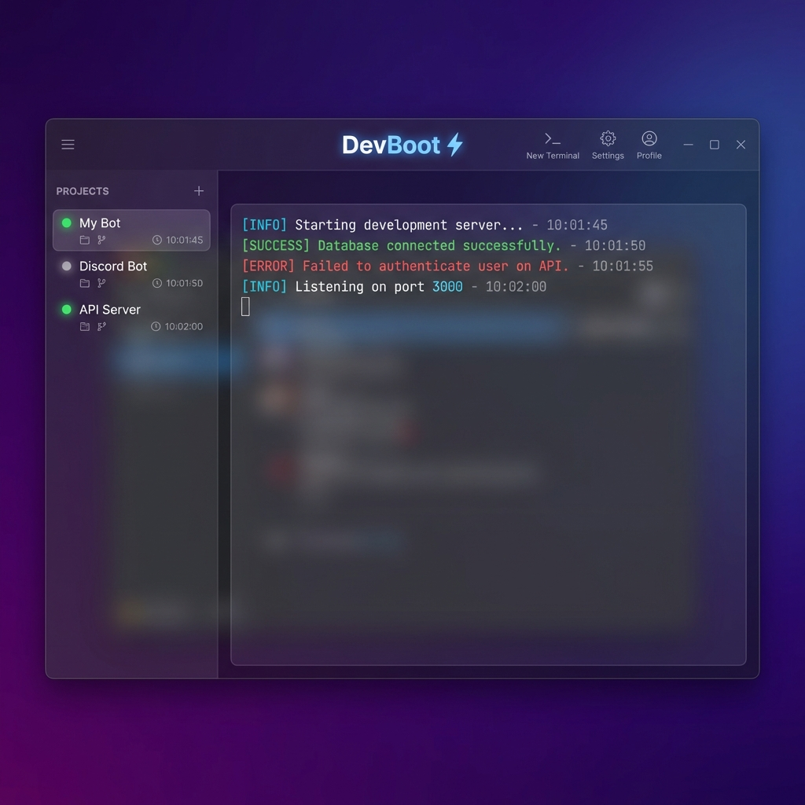
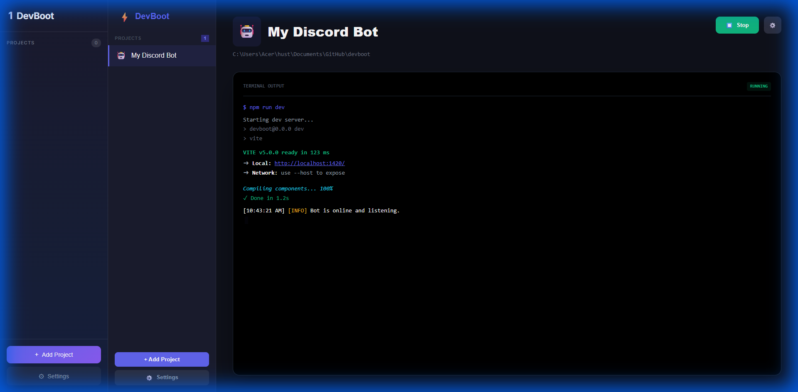
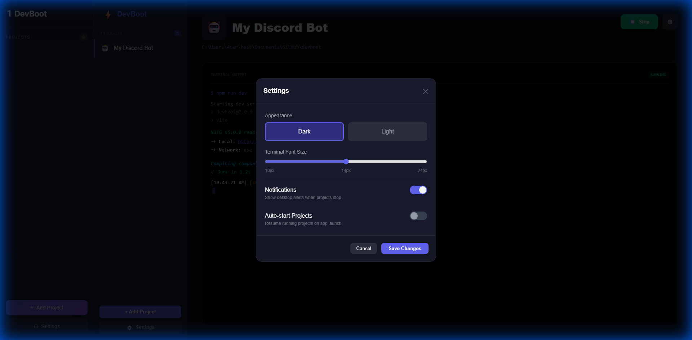

# DevBoot ⚡

> Auto-run your Git Bash projects on startup

<p align="center">
  
</p>

## ✨ Features

- **🖥️ Unified Terminal Management** - Manage all your Git Bash terminals in one beautiful interface
- **🚀 Auto-Start on Boot** - Projects start automatically when Windows boots
- **📊 Real-time Logs** - View stdout/stderr with color-coded output
- **🔄 Auto-Restart on Crash** - Keep your bots and services running 24/7
- **🔔 Smart Notifications** - Get notified when something goes wrong
- **🎨 Modern Dark UI** - Beautiful glassmorphism design

## 🖼️ Screenshots

| Main Interface | Settings |
|----------------|----------|
|  |  |

## 📦 Installation

### Pre-built Binaries

Download the latest release from the [Releases page](https://github.com/tang-vu/devboot/releases).

### Build from Source

**Prerequisites:**
- [Node.js](https://nodejs.org/) (v18+)
- [Rust](https://rustup.rs/) (latest stable)
- [Git Bash](https://git-scm.com/)

```bash
# Clone the repository
git clone https://github.com/tang-vu/devboot.git
cd devboot

# Install dependencies
npm install

# Run in development mode
npm run tauri dev

# Build for production
npm run tauri build
```

## 🔧 Configuration

DevBoot stores its configuration in:
- **Windows:** `%APPDATA%/devboot/config.json`

### Example Configuration

```json
{
  "version": "1.0",
  "settings": {
    "auto_start_with_windows": true,
    "theme": "dark",
    "minimize_to_tray": true,
    "show_notifications": true
  },
  "projects": [
    {
      "id": "uuid-1",
      "name": "My Bot",
      "path": "C:/Users/You/Projects/mybot",
      "commands": [
        "source .venv/Scripts/activate",
        "python main.py"
      ],
      "auto_start": true,
      "restart_on_crash": true,
      "enabled": true
    }
  ]
}
```

## 🎯 Usage

1. **Add a Project** - Click "+ Add Project" and fill in:
   - Project name
   - Project path
   - Commands to run (one per line)

2. **Start/Stop Projects** - Use the play/stop buttons in the sidebar

3. **View Logs** - Click on a project to see its real-time output

4. **Configure Auto-Start** - Enable in Settings to start DevBoot with Windows

## 🛠️ Tech Stack

| Component | Technology |
|-----------|------------|
| Backend | Rust + Tauri |
| Frontend | React + TypeScript |
| Styling | CSS with CSS Variables |
| Process Mgmt | Rust `std::process` |

## 🤝 Contributing

Contributions are welcome! Please read our [Contributing Guide](CONTRIBUTING.md) first.

1. Fork the repository
2. Create your feature branch (`git checkout -b feature/amazing-feature`)
3. Commit your changes (`git commit -m 'Add amazing feature'`)
4. Push to the branch (`git push origin feature/amazing-feature`)
5. Open a Pull Request

## 💖 Support the Project

If you find DevBoot useful, consider supporting its development!

**Ways to support:**
- ⭐ **Star** this repository
- 📢 **Share** with friends and on social media
- 🐛 **Report bugs** and suggest features
- 💻 **Contribute** code improvements

**Buy me a coffee (Crypto):**

| Network | Address |
|---------|---------|
| BSC (BNB Smart Chain) | [`0x051BF9b67aC43BbB461A33E13c21218f304E31BB`](https://bscscan.com/address/0x051BF9b67aC43BbB461A33E13c21218f304E31BB) |
| Polygon | [`0x051BF9b67aC43BbB461A33E13c21218f304E31BB`](https://polygonscan.com/address/0x051BF9b67aC43BbB461A33E13c21218f304E31BB) |
| Arbitrum | [`0x051BF9b67aC43BbB461A33E13c21218f304E31BB`](https://arbiscan.io/address/0x051BF9b67aC43BbB461A33E13c21218f304E31BB) |

> All networks use the same wallet address: `0x051BF9b67aC43BbB461A33E13c21218f304E31BB`

## 📄 License

This project is licensed under the MIT License - see the [LICENSE](LICENSE) file for details.

## 🙏 Acknowledgments

- Built with [Tauri](https://tauri.app/)
- Icons by [Emoji](https://emojipedia.org/)

---

<p align="center">
  Made with ❤️ by the DevBoot Community
</p>
