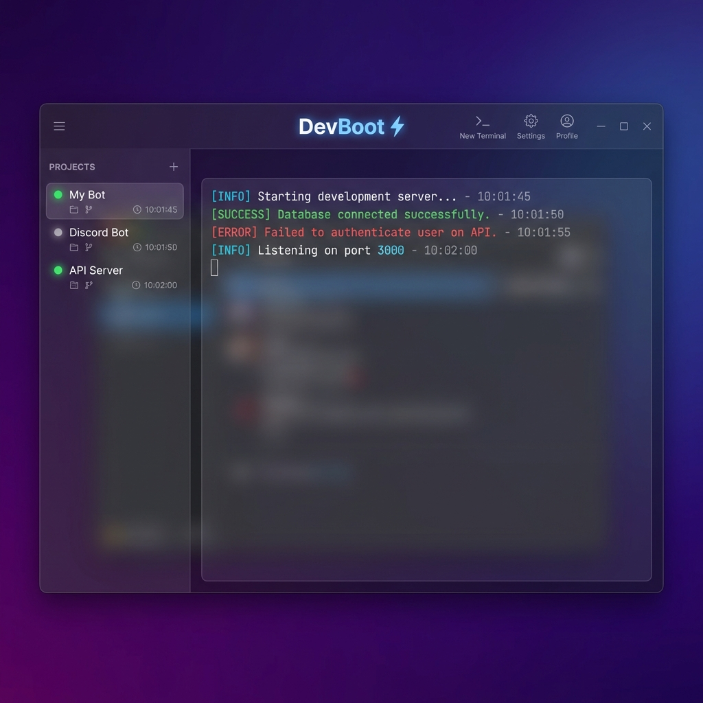
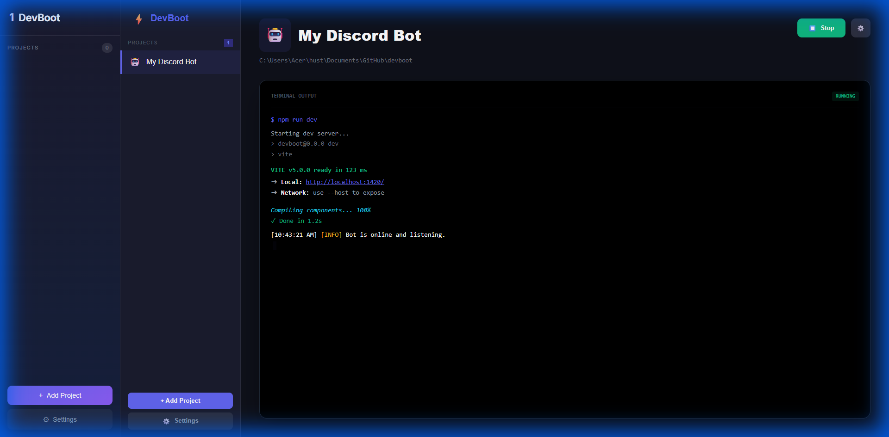
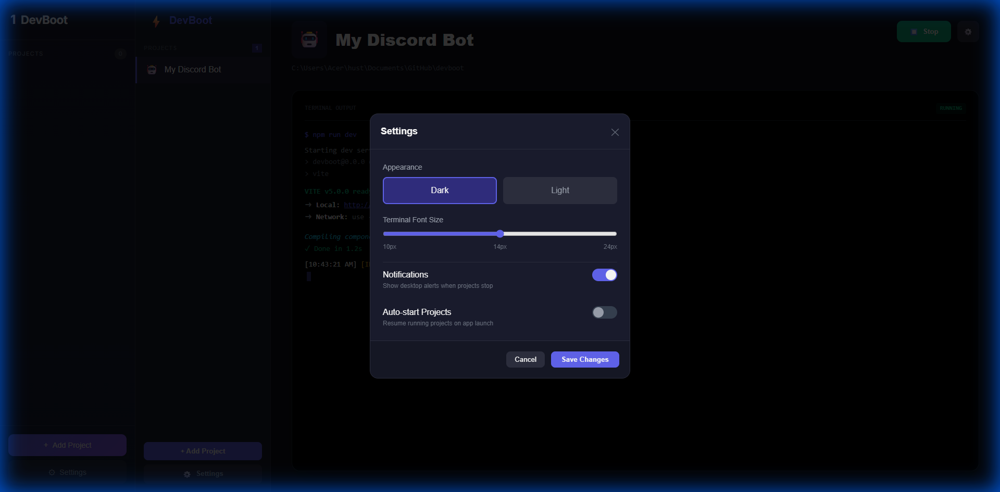
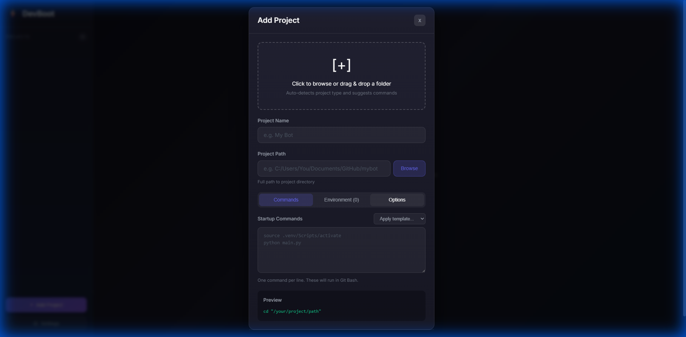

# DevBoot ⚡

> Auto-run your Git Bash projects on startup

<p align="center">
  
</p>

## ✨ Features

- **🖥️ Unified Terminal Management** - Manage all your Git Bash terminals in one beautiful interface
- **🚀 Auto-Start on Boot** - Projects start automatically when Windows boots
- **📊 Real-time Logs** - View stdout/stderr with color-coded output
- **🔄 Auto-Restart on Crash** - Keep your bots and services running 24/7
- **🔔 Smart Notifications** - Get notified when something goes wrong
- **🎨 Modern Dark UI** - Beautiful glassmorphism design

## 🖼️ Screenshots

| Main Interface | Settings |
|----------------|----------|
|  |  |

| Add Project |
|-------------|
|  |

## 📦 Installation

### Pre-built Binaries

Download the latest release from the [Releases page](https://github.com/tang-vu/devboot/releases).

### Build from Source

**Prerequisites:**
- [Node.js](https://nodejs.org/) (v18+)
- [Rust](https://rustup.rs/) (latest stable)
- [Git Bash](https://git-scm.com/)

```bash
# Clone the repository
git clone https://github.com/tang-vu/devboot.git
cd devboot

# Install dependencies
npm install

# Run in development mode
npm run tauri dev

# Build for production
npm run tauri build
```

## 🔧 Configuration

DevBoot stores its configuration in:
- **Windows:** `%APPDATA%/devboot/config.json`

### Example Configuration

```json
{
  "version": "1.0",
  "settings": {
    "auto_start_with_windows": true,
    "theme": "dark",
    "minimize_to_tray": true,
    "show_notifications": true
  },
  "projects": [
    {
      "id": "uuid-1",
      "name": "My Bot",
      "path": "C:/Users/You/Projects/mybot",
      "commands": [
        "source .venv/Scripts/activate",
        "python main.py"
      ],
      "auto_start": true,
      "restart_on_crash": true,
      "enabled": true
    }
  ]
}
```

## 🎯 Usage

1. **Add a Project** - Click "+ Add Project" and fill in:
   - Project name
   - Project path
   - Commands to run (one per line)

2. **Start/Stop Projects** - Use the play/stop buttons in the sidebar

3. **View Logs** - Click on a project to see its real-time output

   Output follows the latest record automatically. Scroll upward or choose
   **Pause following** to read earlier output without losing your place as new
   records arrive. **Resume live** jumps to the latest output and follows again.
   You can Tab to the output area and use normal scrolling keys; Pause/Resume
   also works with Enter or Space. Pausing only changes scrolling: collection
   continues and the latest 1,000 records remain available. If clear or retention
   removes the record you were reading, the view stays paused, shows the earliest
   retained output, and explains that earlier output is no longer available.
   Switching projects or reopening the terminal starts a fresh following view.
   Logs are kept in memory until DevBoot exits; Export saves the currently
   retained records, including records received while reading history.

4. **Configure Auto-Start** - Enable in Settings to start DevBoot with Windows

   Settings waits for your saved preferences before enabling edits. If loading
   fails, choose **Retry loading settings**. **Save Changes** keeps the window
   open until both the preferences and Windows startup choice finish saving;
   controls are disabled while that save is pending. You can still close the
   window, but closing does not cancel a submitted save. Reopening shows the
   submitted values and waits for its result, without allowing a second save.
   A write failure keeps the attempted draft for retry, including if the failure
   arrives after closing. Cancel, the close button, Escape, or the backdrop
   discard the local draft when no save is pending; reopening then uses the last
   confirmed preferences. If preferences were saved but the Windows startup
   update was not confirmed, Settings keeps that notice until a successful
   retry. Closing does not roll back an already submitted operation.

5. **Set Project Environment** - Use the Environment tab when adding or editing a
   project. Values are saved with the project and passed unchanged to its Git Bash
   process on manual start and auto-start. A running process keeps its launch
   environment, including automatic crash retries. After editing values, manually
   restart the project to apply them. Empty values are supported;
   project values override inherited variables and DevBoot's UTF-8 defaults.
   Names must be unique (case-insensitive on Windows), nonempty, and contain no
   `=` or NUL; values cannot contain NUL. Environment values are stored in plain
   text in the project's local configuration file.

6. **Send Terminal Input** - Type in the selected running project's terminal and
   press Enter or click Send. While sending, you can edit the next draft; it is
   preserved when the earlier send finishes. A failed send keeps the current text
   and shows an error so you can retry. Drafts belong only to the current terminal
   view: switching projects or closing the app discards them, including when you
   return to the same project. Stopping and starting a project while staying in
   its view keeps unsent text without sending it automatically. Already submitted
   input is not cancelled by switching or closing the view.

## 🛠️ Tech Stack

| Component | Technology |
|-----------|------------|
| Backend | Rust + Tauri |
| Frontend | React + TypeScript |
| Styling | CSS with CSS Variables |
| Process Mgmt | Rust `std::process` |

## 🤝 Contributing

Contributions are welcome! Please read our [Contributing Guide](CONTRIBUTING.md) first.

1. Fork the repository
2. Create your feature branch (`git checkout -b feature/amazing-feature`)
3. Commit your changes (`git commit -m 'Add amazing feature'`)
4. Push to the branch (`git push origin feature/amazing-feature`)
5. Open a Pull Request

## 💖 Support the Project

If you find DevBoot useful, consider supporting its development!

**Ways to support:**
- ⭐ **Star** this repository
- 📢 **Share** with friends and on social media
- 🐛 **Report bugs** and suggest features
- 💻 **Contribute** code improvements

**Buy me a coffee (Crypto):**

| Network | Address |
|---------|---------|
| BSC (BNB Smart Chain) | [`0x051BF9b67aC43BbB461A33E13c21218f304E31BB`](https://bscscan.com/address/0x051BF9b67aC43BbB461A33E13c21218f304E31BB) |
| Polygon | [`0x051BF9b67aC43BbB461A33E13c21218f304E31BB`](https://polygonscan.com/address/0x051BF9b67aC43BbB461A33E13c21218f304E31BB) |
| Arbitrum | [`0x051BF9b67aC43BbB461A33E13c21218f304E31BB`](https://arbiscan.io/address/0x051BF9b67aC43BbB461A33E13c21218f304E31BB) |

> All networks use the same wallet address: `0x051BF9b67aC43BbB461A33E13c21218f304E31BB`

## 📄 License

This project is licensed under the MIT License - see the [LICENSE](LICENSE) file for details.

## 🙏 Acknowledgments

- Built with [Tauri](https://tauri.app/)
- Icons by [Emoji](https://emojipedia.org/)

---

<p align="center">
  Made with ❤️ by the DevBoot Community
</p>
